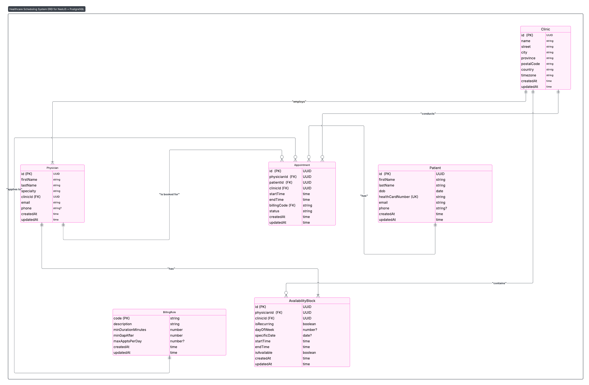

# Nextera EHR – Physician Appointment Scheduler

A scalable, production-grade backend microservice for physician appointment scheduling, built with NestJS and PostgreSQL.

---

## Assumptions

- **Multi-clinic support:** System handles multiple clinics and physicians
- **Ontario billing rules:** Ontario's billing rules are pre-configured in the database.
- **Slot availability:** Providers have predefined available time slots
- **Duration constraints:** Appointment durations range from 5 to 480 minutes (8 hours max)
- **Time granularity:** Ontario clinics use 15-minute intervals (e.g., 9:00, 9:15, 9:30, 9:45)
- **Provider availability:** Providers have set working hours and available slots

---

## Design Document

### **ERD**

>   
> _See [LumiChart](https://lucid.app/lucidchart/4c924f9d-19d7-4e22-b183-05433a9f3a9b/edit?viewport_loc=-675%2C-769%2C4159%2C2677%2C0_0&invitationId=inv_30ce3bc9-dcfa-464e-bb6a-c9aef3b96d71) for the full interactive ERD._

**Entities:**

- Clinic
- Physician
- Patient
- Appointment
- AvailabilityBlock
- BillingRule

### **Key APIs**

#### **POST `/api/appointments/recommend`**

**Request:**

```json
{
  "clinicId": "42df8813-030b-4d02-bf7f-694343788b10",
  "physicianId": "d8ace9be-9529-4f10-9ea0-b8ca6f87de69",
  "patientId": "342610ca-8c17-4f01-8fd9-4b02a7f69b2c",
  "preferredDate": "2025-07-01",
  "durationMinutes": 15
}
```

**Response:**

```json
{
  "status": "success",
  "recommendedSlots": [
    "2025-07-01T09:00:00Z",
    "2025-07-01T10:00:00Z"
    // ...
  ]
}
```

- Returns 200 OK for all recommendations (including "no slots available").
- Returns 400 for validation errors (e.g., invalid UUID, missing fields).
- Returns 400 if the clinic, physician, or patient does not exist.

### **Scheduling Algorithm Logic Flow**

1. **Validate Input Entities**
   - Confirm that the provided `clinicId`, `physicianId`, and `patientId` exist in the database.
   - If any are missing, return a 400 error.

2. **Parse and Localize Date**
   - Convert the `preferredDate` (YYYY-MM-DD) to the clinic’s timezone.
   - Determine the start and end of the day in that timezone.

3. **Fetch Scheduling Data**
   - Retrieve all **availability blocks** for the physician at the clinic on the given day (including both recurring and specific-date blocks).
   - Retrieve all **existing appointments** for the physician at the clinic on the given day (excluding cancelled).
   - Retrieve all **billing rules** for the clinic/physician.

4. **Build Availability Windows**
   - For each availability block, create a time window (interval) in the clinic’s timezone.

5. **Generate Candidate Slots**
   - For each window, slice it into candidate slots of the requested `durationMinutes`.
   - Move the slot start time forward in 15-minute increments (configurable granularity).

6. **Filter Out Conflicting Slots**
   - Remove any candidate slot that overlaps with an existing appointment for the physician at the clinic.

7. **Apply Ontario Billing Gap Rules**
   - For each remaining slot, determine the minimum required gap before and after (from the most relevant billing rule).
   - Penalize the slot’s score if the gap before or after is less than required.

8. **Score and Rank Slots**
   - Score each slot based on:
     - Sufficient gap before/after (bonus/penalty)
     - Time of day (e.g., morning slots get a bonus)
     - Clustering (slots with fewer nearby appointments get a bonus)
     - Least disruption (slots that are not tightly packed get a bonus)
   - Only slots with a positive score are considered.

9. **Sort and Select Top Slots**
   - Sort slots by score (descending), then by start time (ascending).
   - Return the top 10 slots (or fewer if less are available), formatted as ISO UTC strings.

10. **Return Result**
    - If slots are available, return them with a `success` status.
    - If no slots are available, return a status indicating no availability or no slots found.

### **How Gaps and Slot Recommendations Are Handled**

- **Ontario Billing Gaps**: Enforced via `minGapAfter` from billing rules.
- **Slot Scoring**: Rewards slots with sufficient gaps, penalizes clustering, and prioritizes least disruptive times.
- **Conflict Avoidance**: Excludes slots overlapping with existing appointments.
- **Extensible**: Logic supports future rules and multi-clinic/provider scenarios.

---

## Setup & Running Locally

```bash
# Install dependencies
npm install

# Set up your PostgreSQL database and update .env

# Run database migrations and seed data
npx prisma migrate deploy
npx ts-node prisma/seed.ts

# Start the server
npm run start:dev
```

API will be available at `http://localhost:3000`.

---

## Testing

```bash
# Run all tests
npm run test

# Run E2E tests
npm run test:e2e
```

- 100% test coverage for business logic and API contract.
- E2E tests use real seed data and validate all edge cases.

---

## API Documentation

- Swagger UI available at: `http://localhost:3000/api/docs`

---

## Postman Collection

- [Download the Postman Collection](./docs/nextera-ehr-api.postman_collection.json)  
  _Import into Postman to try endpoints._

---

## Tech Stack

- **Framework:** NestJS (TypeScript)
- **Database:** PostgreSQL (via Prisma ORM)
- **Testing:** Jest, Supertest
- **API Docs:** Swagger (OpenAPI)

---

## Project Structure

```
nextera-ehr-backend/
  src/
    appointments/      # Scheduling logic, controller, service, DTOs
      dto/
      enums/
    database/          # Database module and service
    main.ts            # App bootstrap
    app.module.ts      # Root module
  prisma/
    schema.prisma      # Database schema
    seed.ts            # Seed data
    migrations/        # Prisma migrations
  docs/                # Design docs, api docs
  test/                # E2E and unit tests
  README.md            # Project overview and setup instructions
  package.json         # Project dependencies and scripts
  ...
```

---

## Contact

- **Author:** [Nidhi Sharma]
- **Email:** [nidhisharma40601@gmail.com](mailto:nidhisharma40601@gmail.com)
- **LinkedIn:** [sharmanidhi0406](https://www.linkedin.com/in/sharmanidhi0406/)

---

## License

MIT
